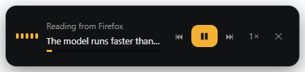
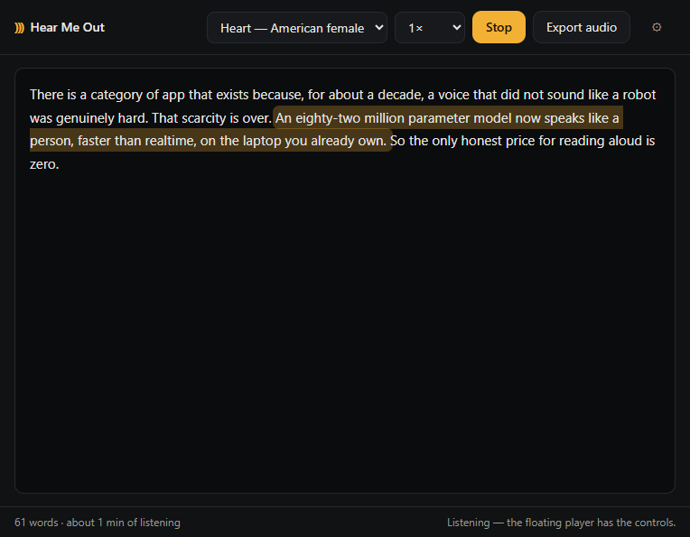
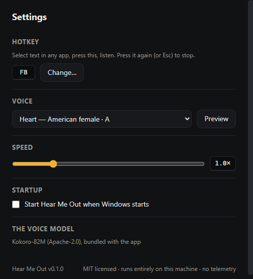

# Hear Me Out

**Select text anywhere. Press a key. Hear it read aloud in a real human voice.**

Free, MIT-licensed, and 100% on your machine. No cloud, no account, no
subscription, no telemetry. Turn Wi-Fi off — everything still works.



*Select text anywhere → press `F8` → this appears and reads to you.*

## Download

Grab the latest build from
[**Releases**](https://github.com/bluejacketblackhawk/hearmeout/releases/latest):
Windows installer or portable zip, macOS `.dmg` or `.zip` (Apple Silicon
and Intel).

> Both platforms will warn about unsigned builds (code-signing certificates
> cost money this project doesn't charge for). Windows: click "More info" →
> "Run anyway". macOS: if Gatekeeper balks, clear the quarantine flag once —
> `xattr -dr com.apple.quarantine "/Applications/Hear Me Out.app"`.

On macOS the welcome screen walks you through the two permissions the gesture
needs: Input Monitoring (hear the hotkey) and Accessibility (grab the
selection). On a Mac laptop keyboard the default hotkey is `Fn`+`F8` — or
rebind it to anything in Settings.

## What it does

- **Read anything on your screen.** Select text in your browser, email,
  PDF viewer, code editor — anywhere — and press the hotkey (`F8` by
  default). A small floating player appears and starts speaking. Press the
  hotkey again, or `Esc`, to stop.
- **A reader for longer things.** Paste an article or drop a `.txt`/`.md`
  file into the reader window and listen with follow-along sentence
  highlighting.
- **Export audio.** Turn any text into a `.wav` you can put on your phone —
  a chapter, your notes, an article for the drive.
- **28 voices, 8 speeds.** American and British, male and female, from the
  Kokoro-82M model (Apache-2.0). Speed from 0.5× to 3× without the chipmunk
  effect.
- **Respects your clipboard.** The selection grab saves your clipboard,
  copies, and puts your clipboard back. You keep what you had.

## Why this exists

Straight up: the paid read-aloud apps are good products. Speechify's premium
plan runs about $139/year, NaturalReader about $119/year, and both send your
text to their servers to be spoken. In 2026 that's paying rent on something
your own computer can do: the open Kokoro-82M model speaks like a person and
runs faster than realtime on an ordinary CPU.

So this is that — the whole product, no meter running. Reading is also an
accessibility need, and the people who need it most shouldn't be the revenue
plan. If it saves you real money, be the kind of person the internet needs
more of: give it to someone who can't pay.

## How it works

- **Voice**: [Kokoro-82M](https://huggingface.co/onnx-community/Kokoro-82M-v1.0-ONNX)
  (Apache-2.0), quantized, running locally via ONNX. The model downloads once
  (~90 MB) — it ships inside the installer, so usually there is nothing to
  download at all.
- **Selection grab**: a tiny native helper (C# on Windows, Swift on macOS —
  each compiled by tools the OS already has) watches only your chosen hotkey
  and fetches the selection. On macOS it asks the Accessibility API outright
  and only falls back to a copy; either way your clipboard is put back. It
  never sees any other keystroke — the source is small, read it.
- **Player**: Electron, one `<audio>` element, sentence-by-sentence streaming
  so long documents start speaking in about a second.
- **The airplane-mode test**: after install, disable networking. Every feature
  still works. That's the whole privacy policy.

## A look around

| The reader, following along | Settings |
|---|---|
|  |  |

## Build from source

Needs Node 24+ — on Windows 10/11 that's everything; on macOS 11+ add the
Xcode Command Line Tools (`xcode-select --install`) for the Swift helper.

```
git clone https://github.com/bluejacketblackhawk/hearmeout.git
cd hearmeout
npm install
npm run setup     # compiles the helper, fetches the voice model (once)
npm start
```

`npm test` runs the unit tests, `npm run smoke` boots the real app and makes
it speak end-to-end, `npm run dist` builds the installer.

## Privacy, precisely

- Selected text goes from the helper to the app over stdio and is synthesized
  in-process. It is not logged, stored, or transmitted.
- The only network operations in the entire app: the one-time model download
  if the bundled copy is missing. There is no update check, no analytics, no
  crash reporter.
- Settings live in a human-readable JSON file in your user folder.

## Roadmap

- Signed + notarized macOS builds (today: unsigned, clear quarantine once)
- EPUB and PDF import in the reader
- Word-level highlight (currently sentence-level)
- MP3/M4B export, chapter files
- More languages as the open model families grow

## Credits

[Kokoro-82M](https://huggingface.co/hexgrad/Kokoro-82M) by hexgrad (Apache-2.0),
ONNX build by the [onnx-community](https://huggingface.co/onnx-community);
[kokoro-js](https://www.npmjs.com/package/kokoro-js) runtime. This app is MIT.
Not affiliated with, endorsed by, or confusable with any company selling
subscriptions to the same idea.
